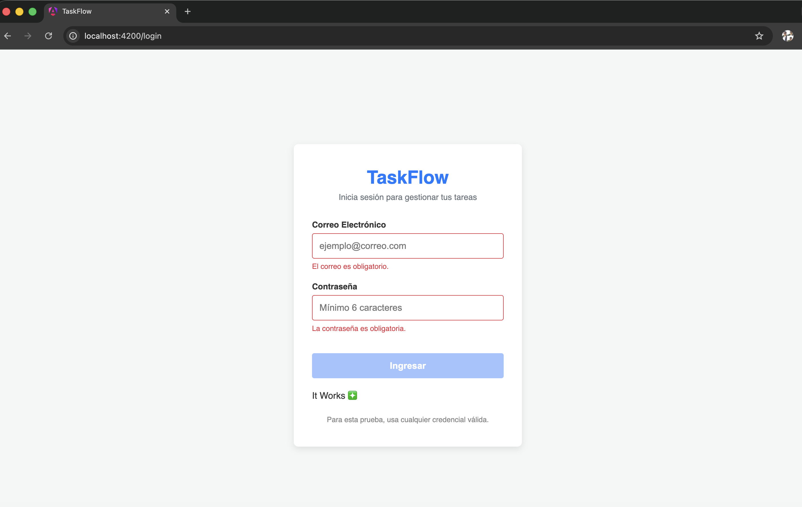
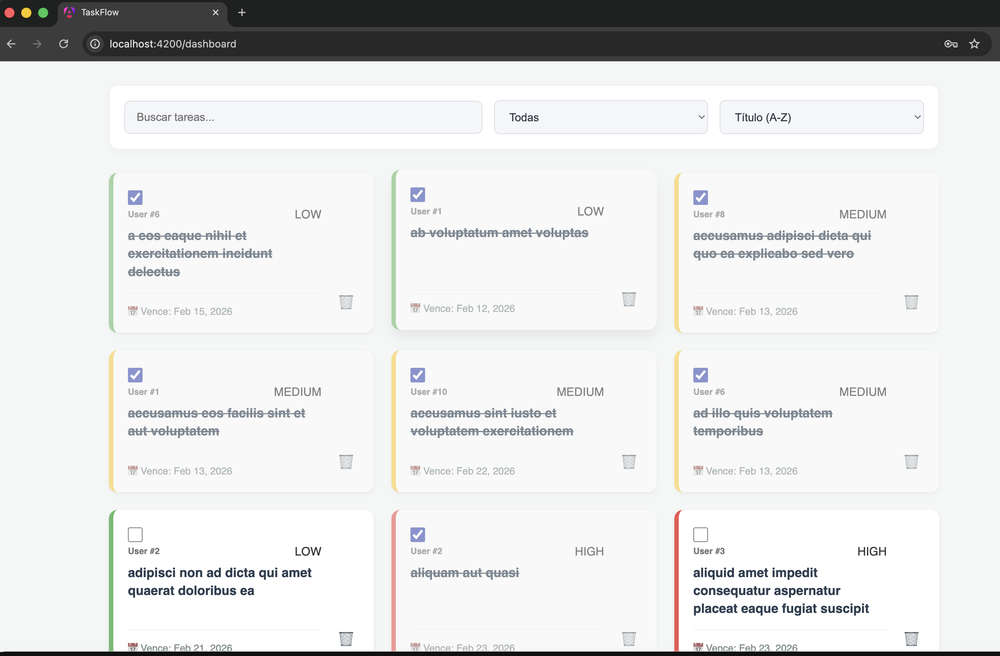
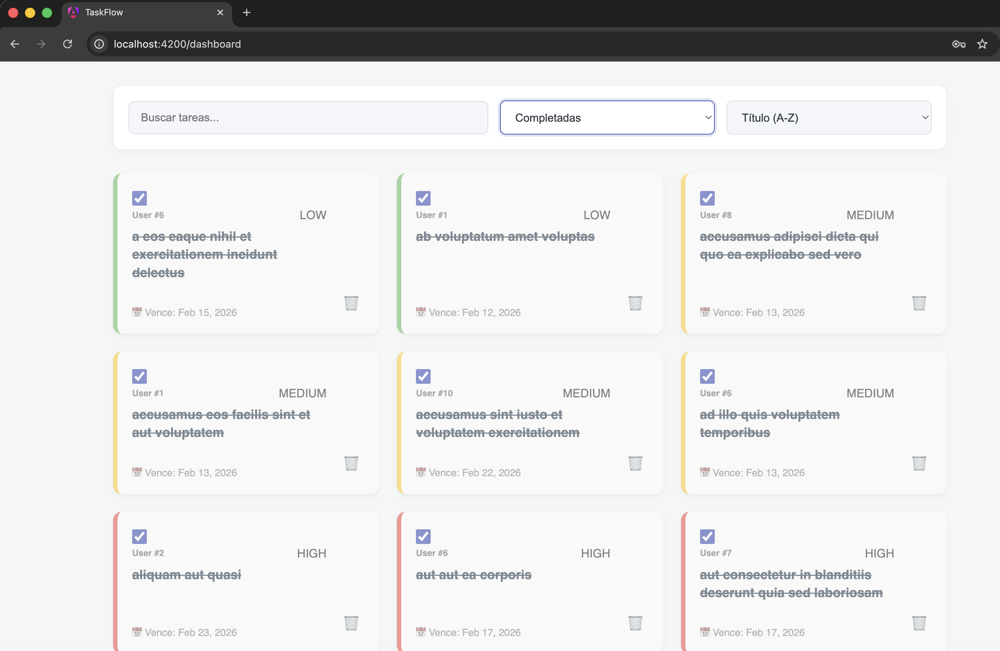
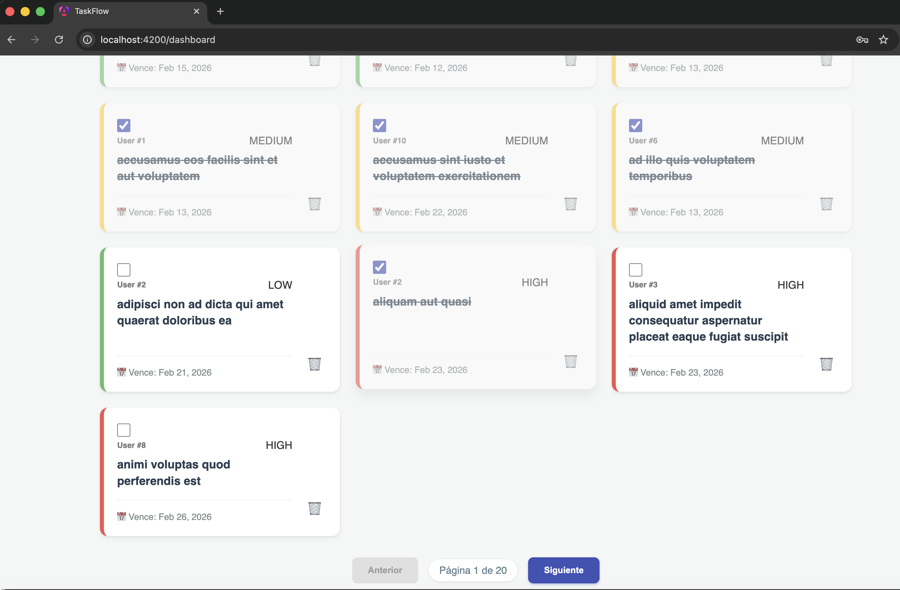
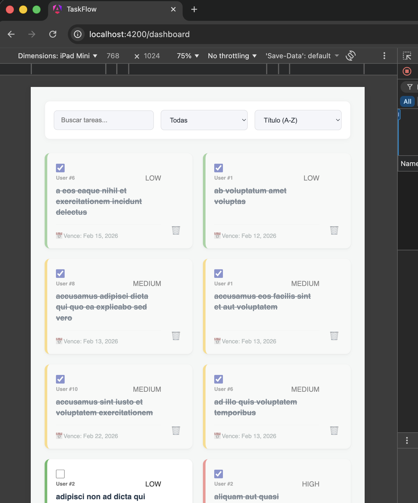
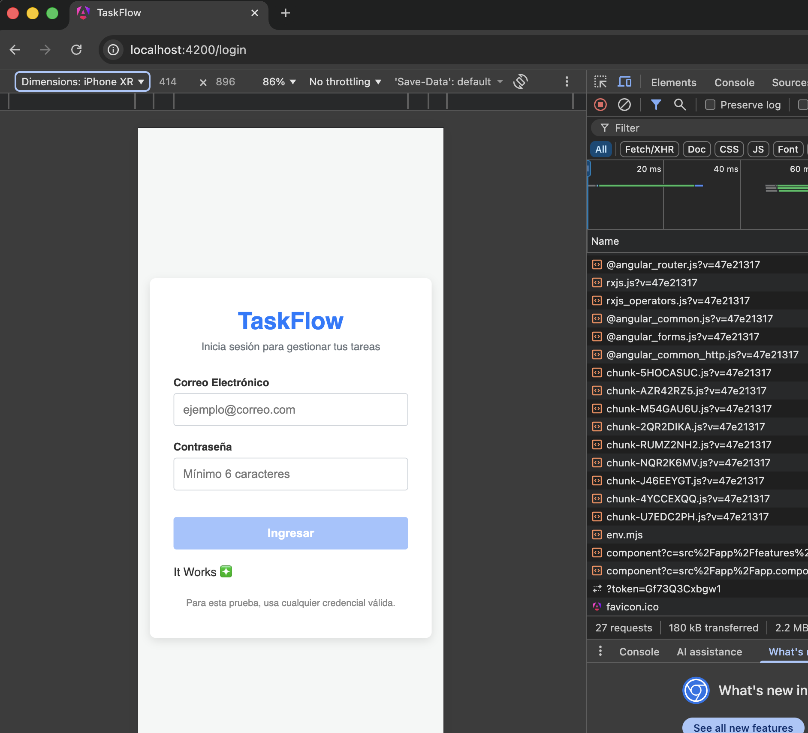
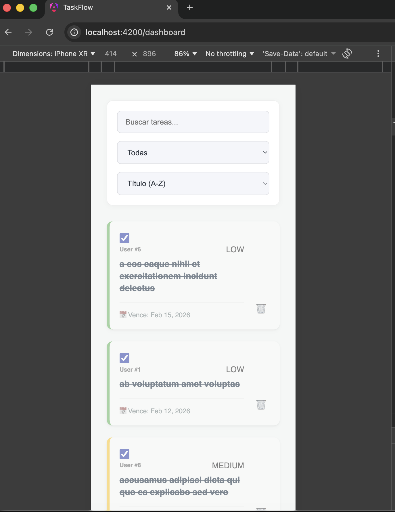

# 🚀 TaskFlow - Modern Angular Dashboard 

This project is a task management application built with the latest features of Angular (Standalone Components, Control Flow, and Signals). It focuses on performance, user experience (UX), and a scalable architecture. Also, I maintained clean code practices and avoided adding unnecessary files. With this version of Angular, the performance is truly incredible, maintaining scalability across the entire application while following core programming principles.

## 🎯 Implemented Features

- [x] **List and Pagination:** Optimized rendering of 200 elements consumed from JSONPlaceholder, featuring native pagination of 10 items per page.
- [x] **Reactive Search:** Title filtering with a 300ms `debounceTime` to optimize performance and avoid unnecessary renders.
- [x] **Filters and Sorting:** Dynamic multi criteria sorting (Priority, Date, and Title) and state filtering (Pending vs. Completed).
- [x] **Load Indicators (UX):** Implementation of Skeleton Loaders and Spinners with a simulated 3.5s API delay to ensure proper visual feedback on slow connections.
- [x] **Resilience:** Automatic retry for HTTP requests (`retry(3)`) and user-friendly error handling.
- [x] **DOM Optimization:** Use of the `track` instruction (the modern equivalent of `trackBy`) within rendering loops.
- [x] **Lazy Loading:** Dashboard module lazy-loaded using the `loadComponent` approach.

---

## 🏗️ Architecture and Technical Decisions

### 1. State Management (Signals + RxJS)
Taking this hybrid approach highlights the core strengths of both tools:
* **RxJS:** Used to manage asynchronous data flows and time-based complexity, such as the search `debounceTime` and HTTP requests.
* **Signals:** Used for synchronous, local reactive state within the `TaskStore`. By leveraging the `toSignal()` function, we eliminated the need for the `async` pipe and manual subscriptions, completely preventing memory leaks.

### 2. Adapter Pattern in the Service Layer
Knowing that the `JSONPlaceholder` API doesn't provide all the required properties, this pattern helps us seamlessly add missing fields like `priority` and `dueDate`. The service transforms the raw data, injecting the necessary properties to accurately evaluate sorting and filtering logic in the UI without breaking strict typing.

### 3. Modular SCSS Design System
Avoided external UI libraries to demonstrate native proficiency with CSS/SCSS:
* **Variables and Mixins:** Centralized design tokens in `_variables.scss` and created a reusable `@mixin` to handle the responsive layout, adapting the grid to 1, 2, or 3 columns depending on the device.
* **High-Performance Animations:** Used pure CSS transformations for the Skeleton Loader and pseudo-elements (`::before`) for the interactive background, ensuring smooth UX while freeing up the main JavaScript thread.

## 4. State Management
To adhere to best practices, I implemented a Custom Store based on the reactive design pattern using Angular Signals. By avoiding heavy external state management libraries, we significantly minimize the final bundle size. This approach ensures strict immutability from the view layer and leverages `computed` Signals to heavily optimize the filtering logic, paving the way for a modern, Zoneless-ready architecture.
---

## 🧠 Resolución de Casos Arquitectónicos

Como parte de la evaluación técnica, a continuación se detalla la estrategia para los siguientes escenarios empresariales:

### A. ¿Cómo manejarías el refresh token en una integración real con Azure AD B2C?
Implementaría un interceptor `HttpInterceptor` que se encargue de revisar los errores 401. Al detectarlo, el interceptor pausa las peticiones HTTP salientes encolándolas en un `BehaviorSubject`, y mientras esta puasada por asi decirlo, se llama al endpoint de Azure AD B2C atravez del MSAL para tener un nuevo token y se ejecuta siendo transparente para el usuario evitando mala experiencia de usuario y seria un silent refresh. 

### B. ¿Qué estrategia usarías para cachear las respuestas de la API de tareas?
Esto depende de la API y su tiempo de respuesta, pero se podria aplicar un **Caché por Tiempo de Vida (TTL)** a nivel de Store que ya se tiene en este momento. Al cargar las tareas, guardaría una fecha timeStamp. Si el usuario reingresa dentro de cierto periodo, se muestran los datos en memoria y se hace una peticion en segundo plano para hacer un refresh de la data en segundo plano, para traer las tareas actuales y evitar inconsistencias entre la data y el backend. 

### C. Server-Side Rendering (SSR)
Implementaría SSR configurando `@angular/ssr` para aprovechar las nuevas funciones de Angular que estan en las ultimas versiones y evitaria un pre-renderizado directamente desde Node.js.
**Beneficios:** 
1. Mejora la percepcion de velocidad.
2. Indexación en los motores de búsqueda (SEO).
3. Capacidad de generar metadatos para previsualizaciones en redes sociales.

---

## 📸 App Screenshots

### Desktop Experience

  

  

  

  

### Tablet & Mobile Experience

  

  
  &nbsp;&nbsp;&nbsp;&nbsp;
  

## ⚙️ Installation and Setup

1. Clone the repository.
2. Install dependencies:
   npm install

